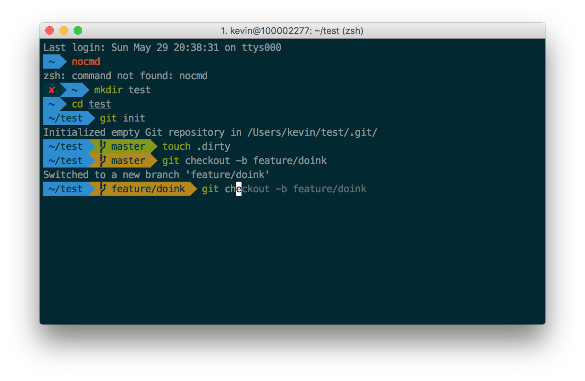
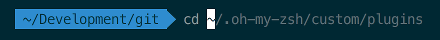

# OS X Shell Setup



*Forked from <https://gist.github.com/kevin-smets/8568070>.*

## Install Homebrew

The installation process recommended by [Homebrew](http://brew.sh/) is quite simple. Just run:

```sh
/usr/bin/ruby -e "$(curl -fsSL https://raw.githubusercontent.com/Homebrew/install/master/install)"
```

If this doesn't work for you (e.g. if you're still on OS X 10.5), they offer [alternatives](https://github.com/Homebrew/brew/blob/master/docs/Installation.md#alternative-installs).

## iTerm2

### Install

Now that you've installed Homebrew, you can just run:

```sh
brew cask install iterm2
```
    
Alternatively, you can [download](http://www.iterm2.com/downloads.html) the latest test release or nightly build if you're feeling adventurous.

### Install color schemes

iTerm2 has better color fidelity than the built in Terminal, so your themes will look better.
    
Get the iTerm color settings

- [Solarized Dark theme](https://raw.githubusercontent.com/altercation/solarized/master/iterm2-colors-solarized/Solarized%20Dark.itermcolors)
- [Solarized Light theme](https://raw.githubusercontent.com/altercation/solarized/master/iterm2-colors-solarized/Solarized%20Light.itermcolors)
- [More themes @ iterm2colorschemes](http://iterm2colorschemes.com/)
    
Just save it somewhere and open the file(s). The color settings will be imported into iTerm2. Apply them in iTerm through **iTerm2 → Preferences → Profiles → Colors → Color Presets**. You can create a different profile other than `Default` if you wish to do so.

## Oh My Zsh 

More info here: https://github.com/robbyrussell/oh-my-zsh

### Install

Go ahead and install with `curl`, but they do offer [alternatives](https://github.com/robbyrussell/oh-my-zsh#basic-installation).
    
```sh
sh -c "$(curl -fsSL https://raw.github.com/robbyrussell/oh-my-zsh/master/tools/install.sh)"
```

### Set a theme

Edit `~/.zshrc` and set `ZSH_THEME="agnoster"`.

## Install a patched font

- [Meslo](https://github.com/Lokaltog/powerline-fonts/blob/master/Meslo/Meslo%20LG%20M%20DZ%20Regular%20for%20Powerline.otf) (the one in the screenshot). Click "view raw" to download the font.
- [Others @ powerline fonts](https://github.com/powerline/fonts)
    
Open the downloaded font and press "Install Font".

Set this font in iTerm2 (14px is my personal preference) via **iTerm2 → Preferences → Profiles → Text → Change Font**.

Restart iTerm2 for all changes to take effect.

## Further tweaking

Things like

- auto suggestions
- word jumping with arrow keys
- shorter prompt style
- syntax highlighting

can be found in the section below.

### Auto suggestions



Just follow the [steps](https://github.com/tarruda/zsh-autosuggestions#oh-my-zsh), included here for convenience:

1. Clone the repository into `$ZSH_CUSTOM/plugins` (by default `~/.oh-my-zsh/custom/plugins`)

    ```sh
    git clone git://github.com/zsh-users/zsh-autosuggestions $ZSH_CUSTOM/plugins/zsh-autosuggestions
    ```

2. Add the plugin to `~/.zshrc`:

    ```sh
    plugins=(... zsh-autosuggestions)
    ```
    
3. Source `~/.zshrc` (or just start a new session).

    ```sh
    source ~/.zshrc
    ```
    
If the auto suggestions do not appear to show, it could be a problem with your color scheme. Under **iTerm2 → Preferences → Profiles → Colors**, check the value of Black Bright, that is the color your auto suggestions will have. It will be displayed on top of the Background color, so if there is not enough contrast between the two, you won't see the suggestions, even if they're actually there.. For Solarized Dark I changed the value of Black Bright to "586e75".

### Enable word jumps

By default, word jumps (<kbd>⌥</kbd> + <kbd>→</kbd> and <kbd>⌥</kbd> + <kbd>←</kbd>) do not work. To enable these, go to **iTerm2 → Preferences → Profiles → Keys**. Press the + sign under the list of key mappings and add the following sequences:

#### Option + right

```
⌥→
Send Escape Sequence
f
```

#### Option + left

```
⌥←
Send Escape Sequence
b
```

### Shorter prompt style

By default, your prompt will now show “user@hostname” in the prompt. This will make your prompt rather bloated. Optionally set `DEFAULT_USER` in `~/.zshrc` to your regular username (these must match) to hide the “user@hostname” info when you’re logged in as yourself on your local machine. You can get your exact username value by executing `whoami` in the terminal.

### Syntax highlighting

```
brew install zsh-syntax-highlighting
```

If you do not have or do not like homebrew, follow [the installation instructions](https://github.com/zsh-users/zsh-syntax-highlighting/blob/master/INSTALL.md) instead.

After installation through homebrew, add

```
source /usr/local/share/zsh-syntax-highlighting/zsh-syntax-highlighting.zsh
```

to the *end* of your `.zshrc` file. After that, it's best to restart your terminal. Sourcing your `~/.zshrc` does not seem to work well with this plugin.
